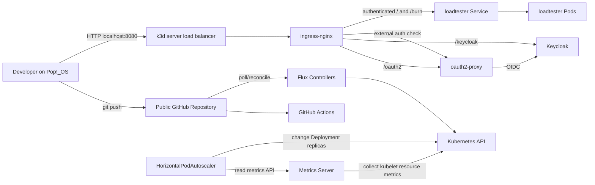

# MLOps Technical Challenge

Local Kubernetes platform on **Pop!_OS**: **k3d** + **FluxCD** + **ingress-nginx** + **Metrics Server** / **HPA** + **Keycloak** / **oauth2-proxy**, with an authenticated concurrent load test and CI validation.

**Repository:** https://github.com/alexpopa2402/MLOps-challenge

---

## Challenge requirements → this repo

| Requirement | Implementation |
|-------------|----------------|
| Public Git repository | This GitHub repo |
| Reproducible local cluster | `cluster/k3d.yaml` (1 server, 2 agents; Traefik + bundled metrics-server disabled) |
| FluxCD continuous reconciliation | Bootstrap → `clusters/local` |
| Ingress via Flux | `ingress-nginx` HelmRelease |
| Provided loadtester app | Vanilla manifests under `apps/loadtester` (pinned image digest) |
| Metrics Server via Flux | HelmRelease in `kube-system` |
| Autoscaling under load | HPA `autoscaling/v2` on CPU/memory |
| OIDC at ingress | Keycloak + oauth2-proxy + Ingress `auth-url` / `auth-signin` |
| Authenticated concurrent load script | `scripts/load_test.py` / `task load:test` |
| Optional CI | GitHub Actions: yamllint, script syntax, **flate** offline Flux test, **kubeconform** schema checks |
| Documentation | This README |

---

## Architecture



### Local URLs (one hostname, path routing)

```text
http://host.k3d.internal:8080/            protected application
http://host.k3d.internal:8080/burn        protected CPU-load endpoint
http://host.k3d.internal:8080/oauth2/     oauth2-proxy
http://host.k3d.internal:8080/keycloak/   Keycloak
```

**k3d load balancer vs ingress-nginx:** k3d forwards host ports (`8080`→`80`) into the cluster. ingress-nginx performs HTTP host/path routing from Ingress resources. Both are required for the curl path above.

---

## Technology decisions

| Choice | Why |
|--------|-----|
| GitHub | Allowed; familiar Actions; first-class Flux bootstrap |
| k3d (k3s in Docker) | Disposable multi-node from a committed config; isolation from any home-lab k3s |
| FluxCD | Git as desired state; HelmReleases for controllers |
| ingress-nginx | Challenge option; `auth-url` integrates cleanly with oauth2-proxy (community project retired Mar 2026 — documented limitation) |
| Metrics Server + HPA | Native CPU/memory autoscaling for `/burn` (not VPA/KEDA). Targets: CPU **60%** / memory **75%** of requests; min **1**, max **6** replicas |
| Keycloak + oauth2-proxy | Auth at ingress; app unchanged |
| No Keycloak PVC | Ephemeral `start-dev`; recreate from Git + local secrets |
| Taskfile | DX wrappers only — not a second deployer |
| flate (not flux-local) | Offline Flux render/test in CI. Raiffeisen case study named [flux-local](https://github.com/allenporter/flux-local); that project is sunsetted — [flate](https://github.com/home-operations/flate) is the maintained successor for the same idea |
| kubeconform | Schema-check rendered core Kubernetes objects (`kubectl kustomize` → kubeconform). Complements flate; Flux CRDs / HelmReleases stay with flate + live reconcile |
| Capacitor Next (optional) | Local Flux UI (`next --port 3333`); not part of GitOps desired state |

---

## Prerequisites

- Docker, kubectl, k3d, flux, helm (useful for inspection), git, GitHub CLI (`gh`), Python 3.10+
- Optional: [Task](https://taskfile.dev/) (`task --list`), [flate](https://github.com/home-operations/flate), [kubeconform](https://github.com/yannh/kubeconform), [Capacitor Next](https://gimlet.io/capacitor-next/)

---

## Quick start

Flux does **not** bootstrap itself into an empty cluster. Manual boundary: create cluster → bootstrap Flux → inject local secrets.

```bash
git clone https://github.com/alexpopa2402/MLOps-challenge.git
cd MLOps-challenge

# 1) Cluster from committed config
k3d cluster create --config cluster/k3d.yaml
# or: task cluster:create

# 2) The app and OIDC URLs use host.k3d.internal:8080, so that name must resolve on your machine. Check with:
grep host.k3d.internal /etc/hosts. 
# If it’s missing, add it manually or with:
echo '127.0.0.1 host.k3d.internal' | sudo tee -a /etc/hosts

# 3) Flux bootstrap (imperative, once per cluster)

# 3.1 Need a logged-in GitHub CLI first
gh auth login
# 3.2 Set the gh CLI token and username:
export GITHUB_TOKEN="$(gh auth token)" 
export GITHUB_USER="$(gh api user --jq .login)"
# 3.3 Point --owner/--repository at this public repo (or your fork).
flux bootstrap github \
  --owner="$GITHUB_USER" \
  --repository="MLOps-challenge" \
  --branch="main" \
  --path="clusters/local" \
  --personal \
  --private=false \
  --token-auth=false
unset GITHUB_TOKEN

# 4) Local secrets (never committed) — file is .challenge_env (underscore)
./scripts/bootstrap-secrets.sh
# or: task secrets

# 5) Wait for layers (controllers → keycloak → oauth2-proxy → applications)
flux get kustomizations -A
kubectl get pods -A
```

Until `challenge-secrets` exists, `keycloak` / `oauth2-proxy` / `applications` stay blocked — that's expected.

### Validate

```bash
# Unauthenticated → 302 to oauth2
task app:test

# Browser: http://host.k3d.internal:8080/  (DEMO_USER_* from .challenge_env)

# Bearer (machine token) — do NOT print the token :)
set -a; source .challenge_env; set +a
TOKEN="$(curl -fsS --max-time 10 -X POST 'http://host.k3d.internal:8080/keycloak/realms/mlops/protocol/openid-connect/token' -H 'Content-Type: application/x-www-form-urlencoded' --data-urlencode 'grant_type=client_credentials' --data-urlencode "client_id=${OAUTH2_PROXY_CLIENT_ID}" --data-urlencode "client_secret=${OAUTH2_PROXY_CLIENT_SECRET}" | python3 -c 'import json,sys; print(json.load(sys.stdin)["access_token"])')"
curl -sS -o /dev/null -w 'GET / -> %{http_code}\n' -H "Authorization: Bearer ${TOKEN}" 'http://host.k3d.internal:8080/'
curl -sS -o /dev/null -w 'GET /burn -> %{http_code}\n' -H "Authorization: Bearer ${TOKEN}" 'http://host.k3d.internal:8080/burn'
unset TOKEN
# Expect: 200 and 202

kubectl top nodes
kubectl -n loadtester get hpa
task load:test          # ~3 min authenticated concurrent /burn
task validate           # yamllint + script syntax (needs yamllint)
task validate:flux      # flate offline Flux test
task validate:kube      # kubeconform on rendered loadtester / Keycloak / oauth2-proxy
```

---

## Repository structure

```text
cluster/k3d.yaml                 # reproducible k3d cluster
clusters/local/                  # Flux root (Kustomizations + flux-system)
infrastructure/controllers/      # ingress-nginx, metrics-server (Helm via Flux)
infrastructure/keycloak/         # Keycloak + declarative realm import
infrastructure/oauth2-proxy/     # oauth2-proxy
apps/loadtester/                 # Deployment (digest-pinned image), Service, Ingress, HPA
scripts/bootstrap-secrets.sh
scripts/load_test.py
docs/evidence/load-test.txt      # sample authenticated load-test output
Taskfile.yml
.challenge_env.example           # template; real file .challenge_env is gitignored
.github/workflows/validate.yaml
```

Flux dependency order: **controllers** → **keycloak** → **oauth2-proxy** → **applications**.

---

## Authentication

### Browser (authorization code)

1. Request `/` → ingress-nginx calls oauth2-proxy `/oauth2/auth`
2. Unauthenticated → redirect to `/oauth2/start` → Keycloak login
3. Callback → session cookie → app

### Machine / load test (client credentials)

1. Script requests token from Keycloak with `grant_type=client_credentials`
2. Sends `Authorization: Bearer <JWT>`
3. oauth2-proxy validates JWT (`--skip-jwt-bearer-tokens=true` means *accept* verified bearer JWTs and skip interactive login — it does **not** mean “ignore Bearer”)
4. Service-account tokens often have `email_verified=false` → local PoC also sets `--insecure-oidc-allow-unverified-email=true`

Secrets: `.challenge_env` → `flux-system/challenge-secrets` → Flux `postBuild.substituteFrom` into Keycloak/oauth2-proxy manifests. Nothing secret is committed (and must not appear in Git history). This is a local bootstrap pattern — not production secret management.

---

## Autoscaling and load test

HPA (`apps/loadtester/hpa.yaml`): CPU average utilization **60%**, memory **75%**, `minReplicas: 1`, `maxReplicas: 6` (relative to container **requests**). Scale-up stabilization **0s**; scale-down window **60s**.

`/burn` starts a background CPU burn (`BURN_DURATION` default **30s**). Responses:

| Code | Meaning |
|------|---------|
| **202** | Burn started on that pod |
| **409** | Pod already burning — **busy under concurrency**, not an auth failure |

### Representative authenticated run

`task load:test` — 180s, concurrency 20 (Bearer via client credentials):

| Metric | Value |
|--------|--------|
| Requests | ~9000 |
| Accepted (202) | ~33 |
| Busy (409) | ~99% |
| Real failures (502/504) | ~0.5% (scale churn) |
| Latency p50 / p95 / p99 | ~290 / ~890 / ~2660 ms |
| Ready replicas | **1 → 6** |
| Avg / peak pod CPU | ~405m / ~500m |
| Avg pod memory | ~41 Mi |

HPA may briefly dip replica count between burn windows, then scale up again — expected with 30s burns.

`task load:test` exits **1** if any 5xx occurred; autoscaling can still succeed. Treat exit code accordingly.

Raw capture (sanitized): [`docs/evidence/load-test.txt`](docs/evidence/load-test.txt).

Optional UI: Capacitor → Kustomization `flux-system/applications` → **Resource Tree** → Deployment badge `N/N`.

---

## CI

`.github/workflows/validate.yaml` on push/PR to `main`:

1. **yamllint** (ignores generated `clusters/local/flux-system/`)
2. **Script syntax** (`bash -n`, `py_compile` on load test)
3. **flate** — `flate test all --path ./clusters/local`
4. **kubeconform** — schema-validate rendered `apps/loadtester`, `infrastructure/keycloak`, `infrastructure/oauth2-proxy` (Kubernetes `1.35.0` schemas, `-strict`)

flate may warn that `substituteFrom` Secret `challenge-secrets` is missing offline and `${VAR}` renders empty — expected; live secrets stay local.

kubeconform covers core Kubernetes objects after `kubectl kustomize`. Flux `HelmRelease` / `Kustomization` CRDs are not the focus of that job — use flate (and live reconcile) for those.

---

## Troubleshooting (real issues from this build)

| Symptom | Cause | Fix |
|---------|--------|-----|
| Flux: missing `bootstrap-admin-secret.yaml` | Wrong filename in kustomization | Use `bootstrap-secret.yaml` |
| Keycloak CrashLoop exit **143** | Liveness killed slow first `start-dev` boot | `startupProbe`; relax liveness |
| oauth2-proxy Kustomization “not found” | Wrong apiVersion (`kustomize.config` vs Flux toolkit) | Use `kustomize.toolkit.fluxcd.io` |
| oauth2-proxy cookie_secret too long | `openssl rand -base64 32` as string | `openssl rand -hex 16` (32 chars) |
| Bearer 401 / redirect | JWT flags / unverified email | `--skip-jwt-bearer-tokens=true` + `--insecure-oidc-allow-unverified-email=true` |
| `.challenge-env` vs `.challenge_env` | Guide hyphen vs repo underscore | Local file is **`.challenge_env`** |
| Load metrics `pods=0` | Wrong label filter | Pods use **`app=loadtester`** |
| “99% load-test errors” | Counting **409** as failures | Report 409 as busy |
| After Flux bootstrap, keycloak Not Ready | No `challenge-secrets` yet | `task secrets` / `./scripts/bootstrap-secrets.sh` |

---

## Clean-room rebuild

Verified: delete cluster → recreate from `cluster/k3d.yaml` → Flux bootstrap → `task secrets` → wait Ready → Bearer `/` **200**, `/burn` **202**.

**Manual every time:** `/etc/hosts`, `gh` auth, Flux bootstrap (owner/repo must match the Git source you want reconciled), local `.challenge_env`, patience for Keycloak first boot.

---

## Limitations and production notes

**Limitations**

- Local k3d PoC, not production Kubernetes
- Keycloak `start-dev`, no PVC, ephemeral data
- Metrics Server `--kubelet-insecure-tls` (local only)
- HTTP only; oauth2-proxy `cookie-secure=false`; unverified-email allow for SA JWTs
- ingress-nginx community project retired (pinned chart; not a greenfield bank recommendation)
- Flux Kustomization intervals: `controllers` / `keycloak` / `oauth2-proxy` / `applications` at **10m** (reconcile manually when iterating)
- Capacitor is laptop-local only

**Production direction (aligned with public platform patterns)**

- Actively maintained ingress / Gateway API; TLS + cert-manager
- External secrets (SOPS / ESO / vault) instead of bootstrap Secret
- HA Keycloak + real DB; NetworkPolicies; image scanning
- Historical metrics (Prometheus/Grafana); keep Metrics Server for HPA
- Offline Flux validation in CI (**flate**; case study historically said flux-local); keep schema checks (**kubeconform**) for app manifests
- Fleet vs app repo separation at scale; Renovate; controlled promotion

---

## Cleanup

```bash
task cluster:delete
# or: k3d cluster delete mlops-challenge
```

Local `.challenge_env` remains on disk until you delete it. Capacitor/`next` is host-only — just stop the process.

---

## Useful links

- [k3d config](https://k3d.io/stable/usage/configfile/)
- [Flux GitHub bootstrap](https://fluxcd.io/flux/installation/bootstrap/github/)
- [ingress-nginx external auth](https://kubernetes.github.io/ingress-nginx/examples/auth/oauth-external-auth/)
- [Metrics Server](https://kubernetes-sigs.github.io/metrics-server/)
- [oauth2-proxy Keycloak OIDC](https://oauth2-proxy.github.io/oauth2-proxy/configuration/providers/keycloak_oidc/)
- [flate](https://github.com/home-operations/flate) · [flux-local (sunset)](https://github.com/allenporter/flux-local)
- [kubeconform](https://github.com/yannh/kubeconform)
- [Mircea Anton — Flux at Raiffeisen (CNDRO 2026)](https://mirceanton.com/talks/cloud-native-days-romania-2026/)
